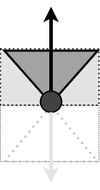

# Vehicle logic

This document describes how vehicle is moving within the simulation map.

## Simulation map

For convenience, we separate the map into 8 parts as follow:


The detail of the simulation map can be found at docs/types/sim-map.md.

## Vehicle init

At the very beginning of the simulation, a list with ```VehicleNumMax``` of vehicles instances will be created and initialized.  ```VehicleNumMin``` of vehicles will be activated.

And then, a ```MisbehaviorVehicleBitMap``` with length of ```VehicleNumMax``` will be created and randomly set ```MisbehaveVehiclePortion```  of bits to 1 as assigning misbehaving vehicles.

Next, all activated vehicles will be placed into the map. According to the difference of the placement position, the ```LastMovementDirection``` will be set. The idea is that, try to make the vehicle moving toward the center of the map.

## Vehicle direction decision

Vehicle can move toward 8 directions, 


According to the ```LastMovementDirection``` of the vehicle, the next movement direction will be decided. As the figure shows, vehicle will try to maintain the ```LastMovementDirection``` , or move within the sector area, or turn left or turn right, but will never go backward.



The detailed possibility of each direction is defined in vehicle/direction.go:

```go
// possibility const
const (
	KeepStraightDirection = 0.5
	SectorDirection       = 0.4
	LeftOrRightDirection  = 0.1
)
```

## Vehicle movement

According to the ```LastMovementDirection``` of the vehicle, the next movement direction will be decided. And then the simulator will move each vehicle to its new position on the map. If the new position of the vehicle is out of map, it will be flagged as ```Inactive``` (corresponding bit of ```ActiveVehiclesBitMap``` will be set to 0).

